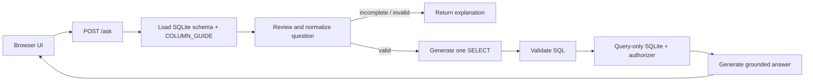

# Architecture

## Purpose

The application answers natural-language questions against one configured
SQLite table while keeping schema knowledge, prompts, orchestration, database
access, and presentation separate.

## Components

| Component | Responsibility |
| --- | --- |
| `static/` | Browser interface and result inspection |
| `app/api.py` | FastAPI routes, validation, and HTTP error mapping |
| `app/workflow.py` | LangGraph state, nodes, and routing |
| `prompts/` | Versioned question-review, SQL, and answer templates |
| `app/schema.py` | Dataset DDL, seed rows, column guide, and examples |
| `app/database.py` | Schema introspection, SQL validation, and execution |
| `app/config.py` | Required environment settings and OpenAI client |

## Request flow

The workflow state is a `TypedDict`. `review_question` is the only conditional
node: non-valid questions end immediately; valid questions continue through SQL
generation, execution, and answer generation.

## Runtime sources of truth

- Environment values: `.env.local`
- Table contract: live SQLite metadata plus `COLUMN_GUIDE`
- Prompt behavior: `prompts/*.yml`
- Workflow behavior: `app/workflow.py`

The API exposes schema metadata to the frontend, which makes the UI independent
of the current table's column names.

## Boundaries

- FastAPI validates the question length before the graph runs.
- Structured OpenAI output constrains review and SQL response shapes.
- Generated SQL remains untrusted and passes through database guardrails.
- Each request is stateless; no conversation history is stored.

See the accepted [architecture decision](adr/0001-schema-guided-read-only-sql.md).
