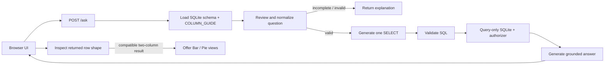

# Architecture

## Purpose

The application answers natural-language questions against one configured
SQLite table while keeping schema knowledge, prompts, orchestration, database
access, and presentation separate.

## Components

| Component | Responsibility |
| --- | --- |
| `static/` | Browser interface, result-shape inspection, and native charts |
| `app/api.py` | FastAPI routes, validation, and HTTP error mapping |
| `app/workflow.py` | LangGraph state, nodes, and routing |
| `prompts/` | Versioned question-review, SQL, and answer templates |
| `app/schema.py` | Column guide and user-facing examples |
| `app/database.py` | Existing-file validation, schema introspection, and guarded queries |
| `app/config.py` | Required environment settings and OpenAI client |

## Request flow

The workflow state is a `TypedDict`. `review_question` is the only conditional
node: non-valid questions end immediately; valid questions continue through SQL
generation, execution, and answer generation.

## Runtime sources of truth

- Environment values: `.env.local`
- Table contract: pre-provisioned SQLite metadata plus `COLUMN_GUIDE`
- Prompt behavior: `prompts/*.yml`
- Workflow behavior: `app/workflow.py`

The API exposes schema metadata to the frontend, which makes the UI independent
of the current table's column names.

Chart eligibility is deterministic browser logic. It uses returned rows only,
does not add a model call, and leaves the `/ask` response contract unchanged.

## Boundaries

- FastAPI validates the question length before the graph runs.
- SQLite is opened in URI read-only mode and is never created or seeded here.
- Structured OpenAI output constrains review and SQL response shapes.
- Generated SQL remains untrusted and passes through database guardrails.
- Each request is stateless; no conversation history is stored.

See the accepted [architecture decision](adr/0001-schema-guided-read-only-sql.md).
